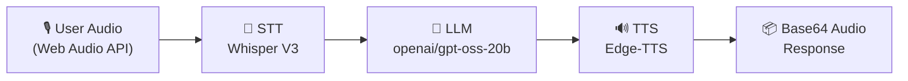

<div align="center">

# 🏛️ Architecture — SofiaVoice v2.0.0 (Rs4Machine)

[🇺🇸 English (this file)](ARCHITECTURE.md) · [🇧🇷 Português do Brasil](ARCHITECTURE.pt-BR.md)

</div>

---

## 📑 Table of Contents

- [Architecture Diagram](#-architecture-diagram)
- [System Overview](#-system-overview)
- [Core Components](#️-core-components)
  - [1. Backend — FastAPI](#1-backend--fastapi-asgi-asynchronous-core)
  - [2. STT — Speech-to-Text](#2-stt--speech-to-text-service)
  - [3. LLM — Large Language Model](#3-llm--large-language-model-service)
  - [4. TTS — Text-to-Speech](#4-tts--text-to-speech-engine)
  - [5. Frontend — Next.js Client](#5-frontend--nextjs-client)
- [Performance & Execution Benchmarks](#-performance--execution-benchmarks)
- [Pipeline Data Flow Sequence](#-pipeline-data-flow-sequence)
- [Version Roadmap Status](#-version-roadmap-status)

---

## 📌 Architecture Diagram



---

## 🎯 System Overview

**SofiaVoice** is a production-grade, full-duplex voice intelligence system designed by **Rs4Machine** (RS4 Lab EXP-005).

The application uses an **asynchronous linear pipeline** (STT → LLM → TTS) orchestrating three independent services built on FastAPI (Python 3.14.2) and Next.js 15.

### 🔄 End-to-End Pipeline

```text
USER AUDIO (Web Audio API)
    ──> STT (Whisper V3)
    ──> LLM (openai/gpt-oss-20b)
    ──> TTS (Edge-TTS)
    ──> BASE64 AUDIO RESPONSE
```

---

## 🏗️ Core Components

### 1. Backend — FastAPI (ASGI Asynchronous Core)

Primary orchestrator handling client HTTP requests, audio payload validation, session logging, and asynchronous execution.

| Attribute | Specification |
|---|---|
| **Framework** | FastAPI 0.141+ (ASGI) |
| **Runtime** | Python 3.14.2 |
| **Hosting Platform** | Render / Production Server |
| **Concurrency Model** | Non-blocking Async Coroutines (`AsyncGroq` + `Edge-TTS`) |
| **Security Controls** | Restricted CORS origins, 10 MB Payload Guard (HTTP 413), XSS Sanitization |

**Backend Directory Structure:**

```
backend/
├── main.py              → App instance, CORS, Security Middlewares
├── config.py            → Environment variables loader
├── requirements.txt     → Edge-TTS, AsyncGroq, FastAPI dependencies
├── routers/
│   └── voice.py         → Asynchronous /api/voice pipeline endpoint
└── services/
    ├── stt.py            → Speech-to-Text service wrapper
    ├── llm.py            → Language Model service wrapper
    └── tts.py            → Text-to-Speech service wrapper
```

---

### 2. STT — Speech-to-Text Service

Converts user audio binary into transcribed text.

| Attribute | Specification |
|---|---|
| **Provider** | Groq API (Async Client) |
| **Model** | Whisper Large V3 |
| **Input Format** | WAV / WebM / MP3 audio payloads |
| **Avg. Latency** | ~0.84 seconds |

---

### 3. LLM — Large Language Model Service

Processes transcribed text with conversational context and returns the assistant's textual response.

| Attribute | Specification |
|---|---|
| **Provider** | Groq API (Async Client) |
| **Model** | openai/gpt-oss-20b (via AsyncGroq) |
| **System Identity** | Sofia — Virtual Assistant by Rs4Machine |
| **Context Management** | Session-isolated history memory (prevents context leakage) |
| **Avg. Latency** | ~0.70 seconds |

---

### 4. TTS — Text-to-Speech Engine

Converts LLM response text into natural neural speech audio.

| Attribute | Specification |
|---|---|
| **Engine** | Microsoft Edge-TTS |
| **Voice Profile** | `pt-BR-FranciscaNeural` |
| **Output Format** | MP3 converted to Base64 string |
| **Avg. Latency** | ~1.60s – 2.50s |
| **Payload Gain** | **52% smaller** compared to legacy gTTS (30.8 KB vs 64.5 KB) |

---

### 5. Frontend — Next.js Client

Provides user interaction interface: audio capture via Web Audio API, real-time terminal visualizer, state management, and audio playback.

| Attribute | Specification |
|---|---|
| **Framework** | Next.js 15.5+ (App Router) |
| **State Machine** | `STANDBY` · `LISTENING` · `PROCESSING` · `SPEAKING` |
| **Hosting Platform** | Vercel |

---

## ⚡ Performance & Execution Benchmarks

| Component / Metric | Baseline v1.0 (gTTS) | Production v2.0.0 (Edge-TTS) | Variance / Optimization |
|---|---|---|---|
| **STT Latency** | ~0.84s | **~0.84s** | Baseline preserved |
| **LLM Latency** | ~0.70s | **~0.70s** | Baseline preserved |
| **TTS Synthesis** | ~4.41s | **~1.60s – 2.50s** | **~40% faster execution** |
| **Payload Size** | 64.5 KB | **30.8 KB** | **52% size reduction** |
| **Event Loop Model** | Synchronous (Blocking) | **Pure Async / Non-blocking** | Concurrency blockers eliminated |

---

## 📡 Pipeline Data Flow Sequence

```text
1. User clicks microphone → Frontend captures audio via Web Audio API
2. Frontend dispatches POST request with audio file to /api/voice
3. Backend validates payload size (< 10 MB) & sanitizes inputs
4. backend/services/stt.py invokes Whisper V3 (Async) → Transcribed Text
5. backend/services/llm.py invokes openai/gpt-oss-20b via AsyncGroq (Async) → Response Text
6. backend/services/tts.py invokes Edge-TTS (Async) → Neural MP3 Audio → Base64
7. Backend returns JSON response:
   {
     "status": "success",
     "user_text": "<transcribed_text>",
     "ai_response": "<ai_text>",
     "audio_base64": "<base64_string>",
     "format": "mp3",
     "latency": { "stt": 0.84, "llm": 0.70, "tts": 1.82, "total": 3.36 }
   }
8. Frontend renders response in Terminal Log & plays Base64 audio stream
```

---

## 🔮 Version Roadmap Status

### ✅ Implemented (v2.0.0)

- Pure asynchronous pipeline STT → LLM → TTS
- Upgrade to openai/gpt-oss-20b via Groq Async SDK (replacing the legacy LLaMA 3.3 70B baseline) + Whisper Large V3
- Microsoft Edge-TTS integration (FranciscaNeural voice)
- Hardened CORS policy, 10 MB Payload Guard, and UTF-8 safe loggers
- Session-isolated context memory
- Production deployments on Vercel (Frontend) and Render (Backend)

### ⏳ Future Architecture (v3.0 Streaming — FASE 19)

- WebSocket Router (`/ws/audio`) and Server-Sent Events (SSE) support
- `ConnectionManager` for real-time heartbeat and session management
- Frontend Jitter Buffer client for low-latency streaming audio playback

<div align="center">

*SofiaVoice v2.0.0 — September 2026*

</div>