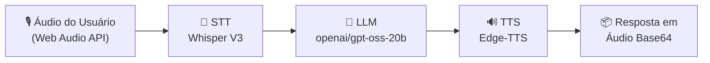

<div align="center">

# 🏛️ Arquitetura — SofiaVoice v2.0.0 (Rs4Machine)

[🇺🇸 English](ARCHITECTURE.md) · [🇧🇷 Português do Brasil (este arquivo)](ARCHITECTURE.pt-BR.md)

</div>

---

## 📑 Sumário

- [Diagrama de Arquitetura](#-diagrama-de-arquitetura)
- [Visão Geral do Sistema](#-visão-geral-do-sistema)
- [Componentes Principais](#️-componentes-principais)
  - [1. Backend — FastAPI](#1-backend--fastapi-núcleo-assíncrono-asgi)
  - [2. STT — Speech-to-Text](#2-stt--serviço-de-speech-to-text)
  - [3. LLM — Modelo de Linguagem](#3-llm--serviço-de-large-language-model)
  - [4. TTS — Text-to-Speech](#4-tts--motor-de-text-to-speech)
  - [5. Frontend — Cliente Next.js](#5-frontend--cliente-nextjs)
- [Benchmarks de Performance & Execução](#-benchmarks-de-performance--execução)
- [Sequência de Fluxo de Dados do Pipeline](#-sequência-de-fluxo-de-dados-do-pipeline)
- [Status do Roadmap de Versões](#-status-do-roadmap-de-versões)

---

## 📌 Diagrama de Arquitetura



---

## 🎯 Visão Geral do Sistema

**SofiaVoice** é um sistema de inteligência de voz full-duplex de nível produção, projetado pela **Rs4Machine** (RS4 Lab EXP-005).

A aplicação utiliza um **pipeline linear assíncrono** (STT → LLM → TTS), orquestrando três serviços independentes construídos sobre FastAPI (Python 3.14.2) e Next.js 15.

### 🔄 Pipeline de Ponta a Ponta

```text
ÁUDIO DO USUÁRIO (Web Audio API)
    ──> STT (Whisper V3)
    ──> LLM (openai/gpt-oss-20b)
    ──> TTS (Edge-TTS)
    ──> RESPOSTA EM ÁUDIO BASE64
```

---

## 🏗️ Componentes Principais

### 1. Backend — FastAPI (Núcleo Assíncrono ASGI)

Orquestrador principal responsável por lidar com requisições HTTP do cliente, validação de payload de áudio, logging de sessão e execução assíncrona.

| Atributo | Especificação |
|---|---|
| **Framework** | FastAPI 0.141+ (ASGI) |
| **Runtime** | Python 3.14.2 |
| **Plataforma de Hospedagem** | Render / Servidor de Produção |
| **Modelo de Concorrência** | Coroutines assíncronas não bloqueantes (`AsyncGroq` + `Edge-TTS`) |
| **Controles de Segurança** | Origens CORS restritas, limite de payload de 10 MB (HTTP 413), sanitização contra XSS |

**Estrutura de Diretórios do Backend:**

```
backend/
├── main.py              → Instância da app, CORS, Middlewares de segurança
├── config.py            → Carregador de variáveis de ambiente
├── requirements.txt     → Dependências: Edge-TTS, AsyncGroq, FastAPI
├── routers/
│   └── voice.py         → Endpoint assíncrono do pipeline /api/voice
└── services/
    ├── stt.py            → Wrapper do serviço de Speech-to-Text
    ├── llm.py            → Wrapper do serviço de Modelo de Linguagem
    └── tts.py            → Wrapper do serviço de Text-to-Speech
```

---

### 2. STT — Serviço de Speech-to-Text

Converte o áudio binário do usuário em texto transcrito.

| Atributo | Especificação |
|---|---|
| **Provedor** | Groq API (Cliente Assíncrono) |
| **Modelo** | Whisper Large V3 |
| **Formato de Entrada** | Payloads de áudio WAV / WebM / MP3 |
| **Latência Média** | ~0.84 segundos |

---

### 3. LLM — Serviço de Large Language Model

Processa o texto transcrito com contexto conversacional e retorna a resposta textual do assistente.

| Atributo | Especificação |
|---|---|
| **Provedor** | Groq API (Cliente Assíncrono) |
| **Modelo** | openai/gpt-oss-20b (via AsyncGroq) |
| **Identidade do Sistema** | Sofia — Assistente Virtual da Rs4Machine |
| **Gerenciamento de Contexto** | Memória de histórico isolada por sessão (previne vazamento de contexto) |
| **Latência Média** | ~0.70 segundos |

---

### 4. TTS — Motor de Text-to-Speech

Converte o texto de resposta do LLM em áudio de fala neural natural.

| Atributo | Especificação |
|---|---|
| **Motor** | Microsoft Edge-TTS |
| **Perfil de Voz** | `pt-BR-FranciscaNeural` |
| **Formato de Saída** | MP3 convertido para string Base64 |
| **Latência Média** | ~1.60s – 2.50s |
| **Ganho de Payload** | **52% menor** em comparação ao gTTS legado (30.8 KB vs 64.5 KB) |

---

### 5. Frontend — Cliente Next.js

Fornece a interface de interação do usuário: captura de áudio via Web Audio API, visualizador de terminal em tempo real, gerenciamento de estado e reprodução de áudio.

| Atributo | Especificação |
|---|---|
| **Framework** | Next.js 15.5+ (App Router) |
| **Máquina de Estados** | `STANDBY` · `LISTENING` · `PROCESSING` · `SPEAKING` |
| **Plataforma de Hospedagem** | Vercel |

---

## ⚡ Benchmarks de Performance & Execução

| Componente / Métrica | Baseline v1.0 (gTTS) | Produção v2.0.0 (Edge-TTS) | Variação / Otimização |
|---|---|---|---|
| **Latência STT** | ~0.84s | **~0.84s** | Baseline preservado |
| **Latência LLM** | ~0.70s | **~0.70s** | Baseline preservado |
| **Síntese TTS** | ~4.41s | **~1.60s – 2.50s** | **~40% mais rápido** |
| **Tamanho do Payload** | 64.5 KB | **30.8 KB** | **52% de redução** |
| **Modelo de Event Loop** | Síncrono (Bloqueante) | **Puramente Assíncrono** | Bloqueios de concorrência eliminados |

---

## 📡 Sequência de Fluxo de Dados do Pipeline

```text
1. Usuário clica no microfone → Frontend captura áudio via Web Audio API
2. Frontend dispara requisição POST com o arquivo de áudio para /api/voice
3. Backend valida o tamanho do payload (< 10 MB) e sanitiza as entradas
4. backend/services/stt.py invoca o Whisper V3 (Async) → Texto Transcrito
5. backend/services/llm.py invoca o openai/gpt-oss-20b via AsyncGroq (Async) → Texto de Resposta
6. backend/services/tts.py invoca o Edge-TTS (Async) → Áudio MP3 Neural → Base64
7. Backend retorna a resposta JSON:
   {
     "status": "success",
     "user_text": "<texto_transcrito>",
     "ai_response": "<texto_da_ia>",
     "audio_base64": "<string_base64>",
     "format": "mp3",
     "latency": { "stt": 0.84, "llm": 0.70, "tts": 1.82, "total": 3.36 }
   }
8. Frontend renderiza a resposta no Terminal Log & reproduz o stream de áudio Base64
```

---

## 🔮 Status do Roadmap de Versões

### ✅ Implementado (v2.0.0)

- Pipeline puramente assíncrono STT → LLM → TTS
- Upgrade para openai/gpt-oss-20b via Groq Async SDK (substituindo o baseline LLaMA 3.3 70B) + Whisper Large V3
- Integração com Microsoft Edge-TTS (voz FranciscaNeural)
- Política de CORS reforçada, Payload Guard de 10 MB e loggers seguros em UTF-8
- Memória de contexto isolada por sessão
- Deploys de produção no Vercel (Frontend) e Render (Backend)

### ⏳ Arquitetura Futura (v3.0 Streaming — FASE 19)

- Roteador WebSocket (`/ws/audio`) e suporte a Server-Sent Events (SSE)
- `ConnectionManager` para heartbeat em tempo real e gerenciamento de sessão
- Cliente Jitter Buffer no frontend para reprodução de áudio em streaming de baixa latência

<div align="center">

*SofiaVoice v2.0.0 — Setembro de 2026*

</div>